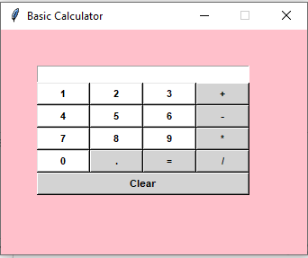

# Calculator Program in Python: four versions 

This is a personal small project containing four versions of a basic calculator. It aims to present different approaches to perform the four basic arithmetic operations: addition, subtraction, multiplication and division, depending upon the user input.  

As my first project, this calculator program has been a great opportunity to develop coding skills. Building four versions for a calculator helped me bring together everything I was learning and understand coding concepts better. My approach was to start small with a simple version of a calculator and then gradually add more functionality later. 
 
### VERSION 1 -> [BasicCalculator_1A.py](https://github.com/alicevillar/basic-calculator/blob/main/BasicCalculator_1A.py)

In this version, user is asked to choose the desired operation and only two numbers are taken to perform the four basic arithmetic operations. User can also choose to see the history of previous calculations.

#### Approach:

The code is divided in two parts: 

#####   Part 1: Functions
    1 -  Function to add two numbers
    2 -  Function to subtract two numbers
    3 -  Function to divide two numbers
    4 -  Function to multiply two numbers
    5 -  Function to store results and see previous calculations

 #####   Part 2: Interacting with user
    1 -  Infinite loop which will end with the break statement
    2 -  Taking input from user 

### VERSION 2 -> [BasicCalculator_1B.py](https://github.com/alicevillar/basic-calculator/blob/main/BasicCalculator_1B.py)

This is the refactored version of Basic Calculator 1A.   

### VERSION 3 -> [BasicCalculator_2A.py](https://github.com/alicevillar/basic-calculator/blob/main/BasicCalculator_2A.py)

This is an upgraded version with two new features: a) possibility to perform basic arithmetic operations with multiple numbers; b) history of previous calculations with date and time.
  
### VERSION 4 -> [BasicCalculator_2B.py](https://github.com/alicevillar/basic-calculator/blob/main/BasicCalculator_2B.py)

This latest version is a calculator in Python using Tkinter to build an interface.  
 
#### Approach:

The code is divided in two parts:

#####   Part 1: Functions
    1 -  Update mathematical expressions when user presses a button
    2 -  Evaluate the final expression using Try/Except for error handling
    3 -  Clear up the content in the Text Box

#####   Part 2: Driver code 
    1 - Creating GUI window and setting configuration
    2 - Instanciating class StringVar to construct a string variable
    3 - Creating an entry box to show the mathematical expressions
    4 - Expression_box.grid (columnspan=4, ipadx=70)
    5 - Placing widgets at respective positions in table-like structure
    6 - Creating buttons and defining their positions in the window
    7 - Starting GUI with a main loop

#### Demo

To build this GUI (Graphical User Interface), I used a tutorial from Greeksfor Greeks [1], but I created an original interface. The tutorial had two problematic issues: 1) it shows the buttons spread apart, and 2) it shows one button left in the end, out of the grid.  

Unlike the tutorial, my model shows the buttons with no space in between. The solution for the second issue was the sticky method applied to the "clear" buttom (sticky="we"), specifying which edges of the cell the widget should be "stuck" to. Specifying two opposite edges, such as we (west, east) means that the widget will be stretched. In this case, it will be stuck to both the left and right edge of the cell. So the widget becomes wider than its original size. For this, I used an article called "The Grid Geometry Manager" [2].

 

#### Resources

[1] GeeksforGeeks. (2021) Python | Simple GUI calculator using Tkinter. Available from: https://www.geeksforgeeks.org/python-simple-gui-calculator-using-tkinter/

[2] TkDocs.The Grid Geometry Manager. Avalable from: https://tkdocs.com/tutorial/grid.html

 
